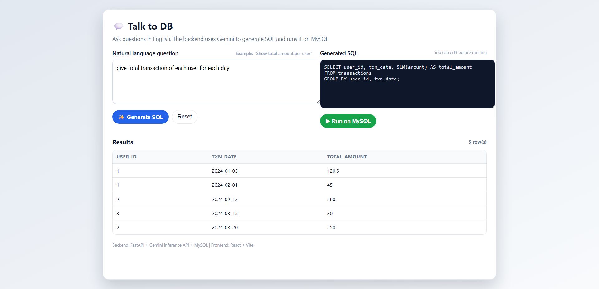
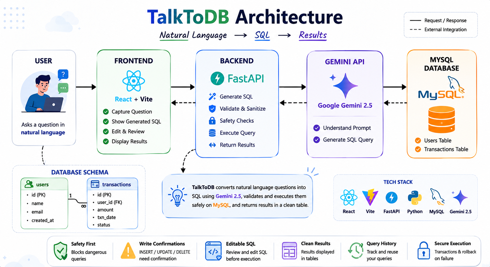

# TalkToDB 💬

TalkToDB is a web application that enables users to query and interact with a MySQL database using natural language. It leverages **Google Gemini 2.5** to convert English questions into valid SQL queries, allows the user to review and edit the generated SQL, and executes it against a MySQL database.



---

## 🏗️ Project Architecture



The codebase is organized into three main directories:

1. **`frontend/`** — A React application built with Vite that provides a clean UI to enter natural language queries, inspect and edit generated SQL, and view table results.
2. **`backend/`** — A FastAPI application that interacts with the Gemini API to translate natural language into SQL, validates queries for safety, and executes them against the MySQL database.
3. **`db/`** — SQL schema definition and a helper Jupyter Notebook (`manage.ipynb`) for database seeding and management.

**Flow:** Natural language question → Gemini generates SQL → user reviews/edits → backend validates and runs on MySQL → results displayed in a table.

---

## 🚀 Getting Started

### Prerequisites

- Python 3.8+
- Node.js (v16+) & npm
- MySQL Server running locally or accessible remotely
- Google Gemini API Key

---

### Step 1: Database Setup

1. Log into your MySQL instance and run the schema file to create the database and seed tables:

   ```bash
   mysql -u root -p < db/schema.sql
   ```

   _Alternatively, run the cells in `db/manage.ipynb` to set up the database._

2. The database schema consists of:
   - **`users`**: `id`, `name`, `email`, `created_at`
   - **`transactions`**: `id`, `user_id`, `amount`, `txn_date`, `status`

---

### Step 2: Backend Configuration & Start

1. Navigate to the backend directory:

   ```bash
   cd backend
   ```

2. Create a virtual environment and activate it:

   ```bash
   python -m venv venv
   # On Windows:
   venv\Scripts\activate
   # On macOS/Linux:
   source venv/bin/activate
   ```

3. Install requirements:

   ```bash
   pip install -r requirements.txt
   ```

4. Create a `.env` file from the example:

   ```bash
   # macOS/Linux:
   cp .env.example .env

   # Windows:
   copy .env.example .env
   ```

5. Edit `.env` and fill in your MySQL connection credentials and Gemini API Key:

   ```env
   DB_HOST=localhost
   DB_PORT=3306
   DB_USER=root
   DB_PASSWORD=your_password
   DB_DATABASE=talktodb
   GEMINI_API_KEY=your_gemini_api_key
   ```

6. Run the FastAPI development server:

   ```bash
   python app.py
   ```

   The server starts at `http://localhost:8000`. API docs are available at `http://localhost:8000/docs`.

---

### Step 3: Frontend Installation & Start

1. Open a new terminal and navigate to the frontend directory:

   ```bash
   cd frontend
   ```

2. Install the npm packages:

   ```bash
   npm install
   ```

3. Start the Vite development server:

   ```bash
   npm run dev
   ```

   The application runs at `http://localhost:5173`.

   > **Note:** Make sure the backend is running at `http://localhost:8000` before using the app.

---

## 🔒 Security & Safety Controls

To prevent unauthorized or destructive database operations, TalkToDB implements:

- **Keyword Blocklist** — Blocks DDL queries containing `DROP`, `TRUNCATE`, `ALTER`, or `CREATE`.
- **Query Type Detection** — Identifies whether a query is a `SELECT`, `INSERT`, `UPDATE`, or `DELETE`.
- **Write Confirmations** — Any write operation (`INSERT`, `UPDATE`, `DELETE`) requires explicit user confirmation before execution.

---

## ✨ Key Features

- **Natural language to SQL** — Ask questions in plain English; Gemini 2.5 generates the query.
- **Editable SQL** — Review and modify generated SQL before running.
- **Clean results** — Query output is displayed in formatted tables.
- **Safe execution** — Dangerous queries are blocked; writes require confirmation.
